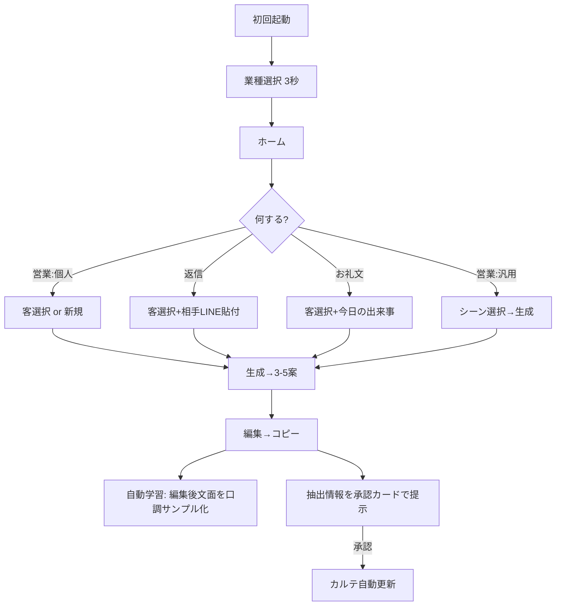

# ヨルリプ (YoruRip) — 仕様書

夜職（キャバ嬢/ホスト/風俗等）向け、AI営業LINE文面生成Webアプリ。
客ごとのカルテとユーザー本人の口調を学習し、刺さる返信文を生成する。

## コンセプト

- **コア価値**: 顧客カルテ × LLM生成 × 口調学習 の3点セット
- **設計思想**: フォーム入力ゼロでスタート可能。使うほどパーソナライズされる
- **送信フロー**: 生成 → コピペで手動送信（LINE自動送信は実装しない）
- **対象業種**: 夜職全般（キャバ/ホスト/ラウンジ/スナック/風俗/チャットレディ等）
- **形態**: PWA対応Webアプリ。将来Capacitorでアプリ化検討

## 技術スタック

- フロントエンド: Nuxt 3 / Vue 3 / TypeScript / Pinia / Tailwind CSS
- PWA: `@vite-pwa/nuxt`
- 画像最適化: `@nuxt/image` (IPX)
- API: Nitro (Nuxt組込)
- DB/Auth: Supabase (PostgreSQL + RLS)
  - 認証: Google OAuth + Email Magic Link + Anonymous Sign-In
  - LINE認証は使わない（情報紐付けリスク回避）
- ローカル永続化: Dexie.js (IndexedDB)
- 状態永続化: `pinia-plugin-persistedstate`
- LLM: Anthropic Claude API（Haiku 4.5主体、Sonnet 4.6を上位プランで）
  - **Tool Use** で口調サンプル蓄積/カルテ抽出を実行
- 決済: Stripe（凍結時はKomojuに切替）
- 監視: Sentry / 解析: Plausible
- ホスティング: Vercel / パッケージ管理: Yarn

## オンボーディングと利用フロー

**初回起動は業種選択のみ**（キャバ/ホスト/風俗/その他）。3秒で完了。
口調訓練・プロフィール・カルテはすべて使用中に自動蓄積される。



## 4つの生成モード

| モード | 必須 | 任意 | 説明 |
|---|---|---|---|
| 営業:汎用 | シーン | プロフィール | 一斉送信用、客個別情報なし |
| 営業:個人 | カルテ | プロフィール | 個別最適化された営業文 |
| 返信 | カルテ + 相手LINE | プロフィール | 受信文への返信 |
| お礼文 | カルテ + 今日の出来事 | プロフィール | 来店後/同伴後のお礼 |

カルテが必要なモードで未登録の場合は、その場で「新規作成」または「クイック入力」を提示。

## 口調学習（自動）

- 初期は業種ペルソナのみで動作（口調未学習でも違和感なく利用可）
- ユーザーが生成案を**編集してコピー**した瞬間、編集後の文面を `tone_samples` に追加
- 5件貯まったらバックグラウンドで `/api/tone/analyze` 実行
  - 抽出: 語尾癖、絵文字密度、平均文長、改行スタイル、頻出フレーズ
- 以降の生成プロンプトに `tone_features` を常時注入
- 設定画面から手動で口調サンプルの追加/削除/再学習も可能

## カルテ自動作成（Tool Use）と手動入力

LLM応答内で抽出された客情報は、**承認カード**でユーザーに提示してから保存。完全自動保存はしない。
**手動でのカルテ作成・編集・削除も常に可能**（カルテ画面から直接操作）。

Claude APIの Tool Use で以下のツールを定義:

```ts
tools: [
  {
    name: "propose_customer_update",
    description: "会話から抽出した客情報をユーザーに承認用として提示する",
    input_schema: {
      customer_id: string,
      nickname?: string,
      preferences?: object,   // タバコ/酒/シャンパン
      occupation?: string,
      memo?: string,
      ng_time?: string
    }
  },
  {
    name: "propose_customer_create",
    description: "新規客の登録を提案する",
    input_schema: { /* 同上 */ }
  }
]
```

ツール呼び出しがあればフロントで承認カードUIを表示、ユーザータップで初めてDB書き込み。

## ディレクトリ構成

```
/pages          login, home, customers, generate, settings
/components     ApprovalCard, ToneEditor, CustomerForm 等
/composables    useSupabase, useClaudeStream, useDexie, useToneLearner
/stores         Pinia (user, customers, generation, tone)
/server/api     /generate, /tone/analyze, /customers/*, /copy-event
/server/utils   claude.ts (Tool Use), prompts/ (シーン別)
/types          DB型・ドメイン型
/db             Dexieスキーマ
```

## データモデル

```mermaid
erDiagram
    users ||--o{ customers : has
    users ||--|| user_profile : has
    customers ||--o{ visit_logs : has
    customers ||--o{ conversation_memos : has
    users ||--o{ generation_history : has
    users ||--o{ tone_samples : has

    users {
      uuid id PK
      string email
      bool is_anonymous
      timestamp created_at
    }
    user_profile {
      uuid user_id PK_FK
      string industry "kyaba/host/fuzoku/other"
      string genji_name "源氏名(任意)"
      jsonb tone_features "抽出済み口調特徴"
      jsonb ng_words "本名・店名等の出力禁止語"
    }
    tone_samples {
      uuid id PK
      uuid user_id FK
      text content "編集後コピーされた文面"
      string source "auto_edited / manual"
      timestamp created_at
    }
    customers {
      uuid id PK
      uuid user_id FK
      string nickname
      string call_name
      int age
      string occupation
      jsonb preferences
      string customer_type "futo/ita/mame/shio"
      int relation_score "1-5"
      string ng_time
      timestamp last_visit_at
    }
    visit_logs {
      uuid id PK
      uuid customer_id FK
      date visit_date
      int amount
      bool is_dohan
      bool is_after
      text note
    }
    conversation_memos {
      uuid id PK
      uuid customer_id FK
      date memo_date
      text content
      string source "manual / tool_use_approved"
    }
    generation_history {
      uuid id PK
      uuid user_id FK
      uuid customer_id FK
      string mode "general/personal/reply/thanks"
      jsonb input_context
      jsonb output_candidates
      text final_copied "編集後コピーされた最終文面"
      timestamp created_at
    }
```

Supabase RLS必須: 全テーブル `auth.uid() = user_id`。

## API設計 (Nitro)

| メソッド | パス | 用途 |
|---|---|---|
| POST | /api/generate | 4モード共通の生成エンドポイント。Tool Use込み |
| POST | /api/copy-event | 編集後コピー時に呼び出し、口調サンプル化 |
| POST | /api/tone/analyze | サンプル5件以上で口調特徴抽出 |
| POST | /api/customers/approve | 承認カードからのカルテ書込 |
| GET/POST/PATCH/DELETE | /api/customers | カルテ手動CRUD |
| POST | /api/sync | 匿名→正規昇格時の同期（基本不要、念のため） |

`/api/generate` 入力:
```ts
{ mode: 'general'|'personal'|'reply'|'thanks',
  sceneType?: string,
  customerId?: string,
  incomingMessage?: string,
  todayEvent?: string,
  lengthPreference?: 'short'|'medium'|'long' }
```

出力: `{ candidates: string[], toolCalls?: ToolCall[] }`

## プロンプト構造

システムプロンプトに毎回注入:
1. 業種別ペルソナ
2. ユーザー口調特徴（あれば）
3. 対象客カルテ全文（個人モード時）
4. 直近会話メモ3件
5. モード別シーン指示
6. NG語リスト
7. 安全制約: 性的・違法・身体関係への誘導禁止

出力は構造化JSON強制。Tool Use併用。

## 認証とゲストモード

- 初回アクセスは Supabase Anonymous Sign-In で即利用開始
- 匿名でも全機能利用可（DBに `is_anonymous=true` で保存）
- Google/Magic Link でログイン → 同じuser_idのまま昇格
- IndexedDB(Dexie)はオフライン時の下書き＋キャッシュ用に併用

## セキュリティ要件

- Supabase RLS: 全テーブル `auth.uid() = user_id`
- Claude APIキーはサーバー側Nitro環境変数のみ
- アプリ起動時パスコードロック（4桁）をMVPに含める
- Cookie/JWT: `Secure; HttpOnly; SameSite=Lax`
- レート制限: `/api/generate` 10回/分/ユーザー
- Tool Useでの自動カルテ更新は必ず承認カード経由

## MVPスコープ

P0: 4モード生成 / Tool Useでの承認カード式カルテ更新 / 手動カルテCRUD / 自動口調学習 / コピー機能
P1: リマインダー / NG語設定 / パスコードロック / 一斉バリエーション生成
スコープ外: LINE自動送信 / 客返信の自動取込 / 売上分析 / B2B店舗機能

## 用語

- 太客: 高単価客 / 痛客: 迷惑客 / 同伴: 来店前食事 / アフター: 来店後の遊び
- 場内/本指名 / 掘り起こし: しばらく来ない客への再アプローチ
