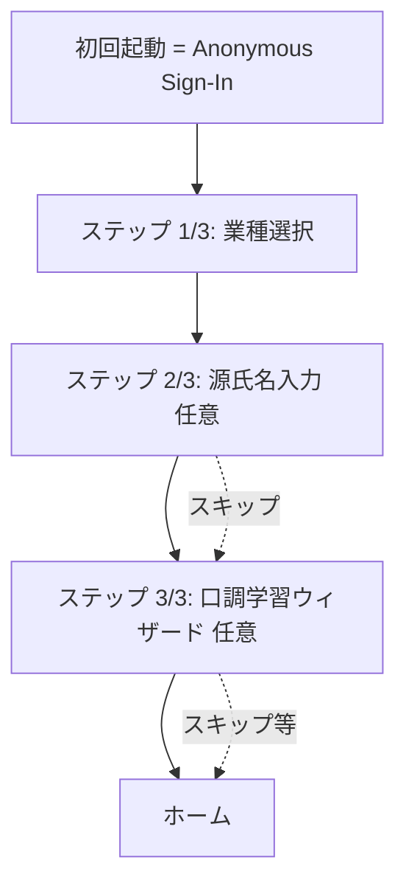

# ヨルリプ (YoruRip) — 仕様書

夜職・コンカフェ向け、AI営業文面生成 Web アプリ。
顧客/ファンの**客情報**(顧客カルテ相当)とユーザー本人の口調を学習し、用途別に最適化された文面を生成する。

## コンセプト

- **コア価値**: 客情報 × LLM生成 × 口調学習 × 用途別最適化
- **設計思想**: フォーム入力ゼロでスタート可能。使うほどパーソナライズされる
- **送信フロー**: 生成 → コピペで手動送信(自動送信は実装しない)。X 公開投稿のみ「Xに投稿」ボタンで `intent/post` に遷移
- **対象業種**: コンカフェ最優先 / その他は順次安定化中
- **形態**: PWA対応Webアプリ。SPA レンダリング(`ssr:false`)を採用。将来Capacitorでアプリ化検討

## 業種別の前提差分(必読)

| 業種 | 主戦場 | 特徴 |
|---|---|---|
| **コンカフェ** (女性キャスト・メイドカフェ等) | X DM / X公開投稿 / IG DM | 推し文化、店舗ルールでLINE禁止が多い、絵文字多用、敬語控えめ、指名なし(推し制度)、チェキ/ドリンクバック |
| **メンコン** (メンズ・執事カフェ等) | X DM / X公開投稿 / IG DM | コンカフェと同じ推し制度、男性キャスト、お嬢/お姫呼称、ホストよりは砕けすぎない |
| キャバ・ラウンジ | LINE | 指名・同伴・アフター、敬語ベース、客単価高 |
| バー(女) | LINE | 砕け敬語、常連化重視、指名/同伴は店次第 |
| ホスト | LINE | 「姫」呼び、絵文字多めの砕けた敬語、シャンパン営業 |
| バー(男) | LINE | 落ち着いた敬語、絵文字控えめ、季節入荷案内 |
| 風俗 | LINE / 写メ日記 | 写メ日記投稿、リピート営業 |
| その他 | LINE | 接客業全般 |

**安定化フラグ**: `INDUSTRY_OPTIONS` の各エントリに `stable?: boolean` を付与し、コンカフェのみ stable=true。それ以外は UI 上「開発中」バッジ表示で品質期待値を下げる。選択自体は引き続き可能。

## 技術スタック

- フロントエンド: Nuxt 3 (SPA / `routeRules['/**']: { ssr: false }`) / Vue 3 / TypeScript / Pinia / Tailwind CSS
- PWA: `@vite-pwa/nuxt`
- 画像最適化: `@nuxt/image` (IPX)
- API: Nitro (Nuxt 組込) — SPA でも `/api/*` はサーバ動作
- DB/Auth: Supabase (PostgreSQL + RLS)
  - 認証: **Anonymous Sign-In(ゲストモード)起点 → Email Magic Link で本登録/ログイン**
  - LINE 認証は使わない
  - セッション永続化は **localStorage**(`useSsrCookies: false`)
- 状態永続化: `pinia-plugin-persistedstate` (localStorage)
- LLM:
  - Anthropic Claude API (Haiku 4.5 主体)。**Tool Use** で 3 案出力 + カルテ提案
  - 口調分析だけ Opus 4.7 (将来 VIP プラン用に切替可能)
  - prompt cache (`cache_control: { type: 'ephemeral' }`) で system + tools をキャッシュ
- 監視: Sentry (P1) / 解析: Plausible (P1)
- ホスティング: Vercel / パッケージ管理: Yarn

## 認証とゲストモード

- 初回アクセスは `signInAnonymously()` で匿名ユーザー払い出し → 即利用開始
- 匿名でも全機能利用可(全データは新規 user_id に紐付く)
- 既存アカウントへのログイン: **`signInWithOtp({ shouldCreateUser: false })`** でメール送信
  - 匿名セッションは既存アカウントのセッションに置き換わる(匿名側データは孤児化)
- 匿名 → 本登録: **`updateUser({ email })`** で email 連携
  - 通常は user_id を維持したまま昇格するが、ブラウザセッションの食い違いや Supabase 側の email_change ハンドリング差で **新しい user_id が払い出されるケースがある**
  - そのため `auth.client.ts` プラグインで `onAuthStateChange` を購読し、SIGNED_IN 時に「旧匿名 user_id」と「新 user_id」が違ったら `/api/auth/migrate-anonymous-data` を叩いてサーバ側でデータ移行する
  - `linkEmail` 呼出時に `localStorage.yorurip.auth_intent = 'link'`、`signInWithEmail` 時は `'switch'` を立てて、移行処理は intent='link' の時だけ実行 (switch は明示的なデータ放棄)
  - 移行サーバ側は **サービスロール (`SUPABASE_SERVICE_KEY`)** が必要 — 旧匿名ユーザーの全テーブル user_id を新ユーザーへ UPDATE → 旧 auth ユーザー削除。`is_anonymous = true` であることを admin API で検証してから移行する
- ホーム画面で `isAnonymous && isOnboarded` の時、最下部にアラートバナー + ヘッダーに「ログイン」ボタン表示

## オンボーディング

3 ステップ構成。各ステップ間はスライド遷移演出。



### ステップ 3/3 の口調学習ウィザード

- DM → お礼 → 公開投稿 の 3 サブステップ
- 各 5 スロット入力、改行貼り付けで自動分配
- 下書きは `useToneDraftStore`(Pinia + localStorage)で永続化 → 途中離脱でも続きから再開可能
- 「次へ」では API を叩かず、最後の「まとめて保存して始める」で **3 チャネル分一括** `addSamples` + 5 件以上ある channel は背景で `runAnalyze`
- 同じウィザード(`<ToneLearningWizard />`)はホーム→「口調学習」リンクからも再利用される
  - その時のヘッダーは「口調学習 ・ N/3」

## 5 つの生成モード × 3 チャネル

### モード

| モード | 必須 | 任意 | 用途 |
|---|---|---|---|
| 営業:汎用 | ─ | シーン / プロフィール | 一斉送信用 |
| 営業:個人 | (customerId か customerName) | シーン / プロフィール | 個別最適化(詳細情報フル活用 or 名前のみの簡易) |
| **単発返信** | (customerId か customerName) + 相手文面 | プロフィール | 受信文への 1 回きりの返信(継続性なし) |
| お礼/感謝 | (customerId か customerName) + 今日の出来事 | プロフィール | 来店後・同伴後のお礼 |
| **公開投稿** | ─ | シーン / プロフィール | X タイムライン投稿(出勤告知・イベント等) |

> モード `reply` は内部値。UI ラベルは「単発返信」。継続的な会話履歴を覚えさせたい場合は後述の「客と会話」(スレッド機能)を使う。

### 客と会話(スレッド機能 / `/threads`)

5 モードとは別系統のフルチャット UI。客 1 人につき 1 セッションを作り、複数往復のやり取りを残しながら AI に返信生成させる。生成時はスレッドの直近 12 件を必ずプロンプトに注入。

- **流れ**:
  1. `/threads/new` で客選択 → スレッド作成
  2. `/threads/[id]` のチャット画面で「客から」「自分から」をトグルしてメッセージを保存
  3. 「✨ 返信を生成」で 3 案を返す → 採用すると自動で `outgoing` メッセージとして履歴に保存
- **チャネル固定**: `dm` (1on1)。口調サンプルも channel='dm' のみを引く
- **設定はスレッドごとに保存**(`default_length` / `default_affection` / `default_reply_flow` / `default_extra_instructions`)。設定モーダル(歯車アイコン)から編集可能
- **mode は `reply` 固定**。汎用/お礼/公開投稿等はスレッド内では選べない
- **削除**: メッセージ単位の削除可、スレッド削除は設定モーダルから(メッセージは CASCADE で消える)
- **Tool Use**: スレッド生成では現状 `submit_candidates` のみで、客情報の自動抽出 (propose_customer_*) は引かない(履歴で十分文脈がある前提)

> **customerName フォールバック**: 営業:個人 / 返信 / お礼の各モードで、未登録の客にも**名前だけ入力すれば生成可能**(プロンプトには「対象客(簡易・未登録)」として名前のみ渡す)。詳細情報があるほど精度が上がるが、未登録でも最低限の文面を作れる。

### チャネル(文体スタイル)

媒体ではなく**文体スタイル**として扱う。LINE/X DM/IG DM は文体的にほぼ同じなので統合。

| チャネル | 旧 | 用途 |
|---|---|---|
| `dm` | line / x_dm / ig_dm を統合 | 1on1 チャット全般 |
| `x_post` | x_post | X 公開投稿 |
| `thanks` | (新設) | お礼/感謝文(感謝トーンが他と顕著に異なるため独立) |

モードからチャネルは自動導出される(`channelForMode(mode)`):
- mode=public_post → channel=x_post
- mode=thanks → channel=thanks
- それ以外 → channel=dm

UI から手動でチャネル選択する画面はない(モード選択で確定する)。

### 各モードのテンプレート(業種別 chip)

- `THANKS_EVENT_TEMPLATES`: お礼モードの「今日の出来事」候補(例: チェキ撮ってくれた、シャンパン入れてくれた)
- `SALES_INTENT_TEMPLATES`: 営業モード(個人/汎用)の「営業したい内容」候補(例: 久しぶりに会いたい、今度イベントあるよ)
- `PUBLIC_POST_TEMPLATES`: 公開投稿モードのシーン候補(例: 出勤告知、チェキ会告知、新衣装お披露目)
- `HASHTAG_SUGGESTIONS`: 公開投稿向けハッシュタグ提案

## ハッシュタグ機能(X 公開投稿)

- **クライアント側のみ管理**(`useXPostHashtagsStore` Pinia + localStorage)。DB と同期しない
- 初期値ハードコード: `DEFAULT_HASHTAGS = ['コンカフェ']`
- 状態は 3 種:
  - **使う**(active): 文末に付与される
  - **使わない**(登録済みだが今回は使わない、または未登録の提案)
  - **dismissed**: 削除モードで永続非表示にしたもの(再起動・再ロードでも非表示)
- **ハッシュタグはプロンプトに含めない**: モデルに「`#` で始まる文字列禁止」を明示し、本文だけ生成させる。アプリ側で `text + '\n' + hashtags` を最終形として組み立てる
- 「使わない」セクションには登録済み非アクティブ + 未 dismiss な提案を統合表示
- ゴミ箱トグルで削除モード ON: chip タップで registered → 完全削除、suggestion → dismiss

## 安全モード設定

設定画面で 3 段階を切替可能。

- **セーフモード**: 体関係や下ネタへの誘いには明確に拒否しつつ代替提案を返す。新人/低リスク運用向け
- **ノーマルモード(デフォルト)**: 夜職の業界基準。下ネタや性的トーンは業界の日常会話の延長として自然に受ける/軽くノる/笑い飛ばす。過剰拒否や説教はしない。ただし肉体関係/本番の確約はしない、露骨な行為描写も出さない
- **スルーモード**: 明確な拒否は避け、関係を断ち切らずやんわり話題を逸らす

3 モード共通で違法行為(本番交渉・薬物等)の助長は絶対不可、未成年関連は強制セーフモード相当。

> セーフモードを別途用意している理由: LLM が性的・恋愛的な誘いを含む文脈で過度に丁寧な拒否や説教モードに入ることがあり、業界に合わない不自然な文を出すケースを防ぐため。ノーマルモードはプロンプト側で「業界基準で自然に処理する」と明示してこれを回避する。

## 愛情度(1〜10)

ユーザーがスライダーで生成毎に指定する温度感パラメータ。プロンプトの最後に注入される。

- **1〜2**: 業務トーン、感情語禁止、絵文字最小
- **3〜4**: やや距離感のある親しみ
- **5〜6**: 程よい親しみ(デフォルト 5)
- **7〜8**: 親密寄り、特別感
- **9〜10**: ガチ恋・太客向け、強めの感情語OK

ただし業種ペルソナの口調は崩さない(下品さや過剰な性的表現は禁止)。

## 口調学習(自動 + 手動)

- 初期は業種ペルソナのみで動作。**最低 5 件** のサンプルが揃うと学習対象になり、`tone_features` がプロンプトに注入される (5 件未満では業種ペルソナのみ)。チュートリアル (オンボーディング 3/3) と `/settings/tone` の両方でこの 5 件下限を明示
- **自動収集**: 生成画面 (`/generate`) と スレッド画面 (`/threads/[id]` の adopt) でユーザーが編集後文面をコピー / 採用した時、`/api/copy-event` が `tone_samples` に `source=auto_edited` で追加。累計件数が 5 の倍数になったタイミングで `/api/tone/analyze` をバックグラウンド発火
  - スレッド側は AI 生成そのままを採用した場合は学習対象外 (それは AI の口調なので)
- **手動操作** (`/settings/tone`):
  - チャネル選択 (?channel=dm|thanks|x_post)
  - 「+ 口調サンプルを追加」ボタンからモーダルで 1 件ずつ追加。0→5件への到達時に分析を発火
  - 既存サンプルはインライン編集 (フォーカス外しで自動保存)
  - **削除はサンプルが 5 件以上ある時のみ可** (4 件以下に減らせない安全弁)
- **再学習 API は明示ボタンを持たない** — auto-collect (コピー時) で十分頻度的にカバーされる前提。誤った大量呼び出しを防ぐ意図
- 分析モデル: Opus 4.7 + adaptive thinking、最新 5 サンプルを入力。サーバ側に **60 秒 / (user, channel) のクールダウン** あり (`consumeCooldown`)
- 抽出: 語尾癖、絵文字密度、平均文長、改行スタイル、頻出フレーズ、文体メモ (toneDescriptor)

> 旧 `tone_samples.source = 'auto_edited'` レコードは過去に自動収集されたもの。互換のため列値は残置、設定画面で「自動収集」ラベルを表示。

## 客情報の自動作成(Tool Use)と手動入力

LLM 応答内で抽出された客情報は**承認カード**で提示してから保存(完全自動保存はしない)。
**手動での客情報の作成・編集・削除も常時可能**(/customers, /customers/[id])。

```ts
tools: [
  {
    name: "submit_candidates",
    description: "3案を提出する。tool_choice: 'any' により実質必須",
    input_schema: { candidates: string[3] }
  },
  {
    name: "propose_customer_update",
    input_schema: {
      customer_id: string,
      nickname?: string,
      preferences?: object,
      occupation?: string,
      memo?: string,
      ng_time?: string,
      cheki_count?: number,
      oshi_rank?: string,
      goods_owned?: string[]
    }
  },
  {
    name: "propose_customer_create",
    input_schema: { /* customer_id 以外同上、nickname 必須 */ }
  }
]
```

承認カード UI(`<ApprovalCard />`)が `/api/customers/approve` を呼ぶ。memo があれば `conversation_memos` に `source=tool_use_approved` で追加保存。

## ディレクトリ構成

```
/pages
  /onboarding   index, genji, tone (3ステップウィザード)
  /customers    index, new, [id]
  /settings     index, tone (口調学習)
  /threads      index, new, [id] (客と会話: スレッド一覧 / 客選択 / チャット画面)
  admin.vue     アカウント管理 (ログアウト / データ初期化 / 完全削除)
  generate.vue  生成画面
  index.vue     ホーム
/components     ApprovalCard, CustomerForm, ToneLearningWizard
/composables    useDB
/stores         Pinia (user, customers, generation, generationHistory, tone, toneDraft, xPostHashtags, threads)
/server/api     /generate, /tone/analyze, /copy-event, /customers/*, /threads/*, /auth/migrate-anonymous-data
/server/utils   claude.ts, auth.ts, rate-limit.ts, prompts/ (業種×モード×チャネル + tone_analysis)
/types          db.ts, domain.ts
/middleware     onboarding.global.ts (業種未選択 → /onboarding 強制)
/plugins        auth.client.ts, persistedstate.client.ts
/supabase/migrations  0001_init 〜 0010_conversation_threads
```

## データモデル

```mermaid
erDiagram
    users ||--o{ customers : has
    users ||--|| user_profile : has
    customers ||--o{ visit_logs : has
    customers ||--o{ conversation_memos : has
    users ||--o{ generation_history : has
    users ||--o{ tone_samples : has

    users {
      uuid id PK
      string email
      bool is_anonymous
      timestamp created_at
    }
    user_profile {
      uuid user_id PK_FK
      string industry "concafe/menkon/kyaba/host/fuzoku/bar_female/bar_male/other"
      string genji_name
      string safety_mode "safe/normal/loose (default: normal)"
      jsonb tone_features "byChannel.{dm/x_post/thanks}.{endings, ...}"
      jsonb ng_words "本名・店名等"
      jsonb x_post_hashtags "(残置・現在は未使用。クライアント localStorage 管理に移行)"
    }
    tone_samples {
      uuid id PK
      uuid user_id FK
      string channel "dm/x_post/thanks"
      text content
      string source "auto_edited/manual"
      timestamp created_at
    }
    customers {
      uuid id PK
      uuid user_id FK
      string nickname
      int age
      string occupation
      jsonb preferences
      string customer_type "futo/ita/mame/shio/oshi_gachi/oshi_enjoy/other_oshi/kake_mochi/peer_cast"
      int relation_score
      string ng_time
      timestamp last_visit_at
      int cheki_count
      jsonb goods_owned
      string oshi_rank
    }
    visit_logs {
      uuid id PK
      uuid customer_id FK
      date visit_date
      int amount
      bool is_dohan
      bool is_after
      int cheki_taken
      jsonb gifts_received
      text note
    }
    conversation_memos {
      uuid id PK
      uuid customer_id FK
      date memo_date
      text content
      string source "manual/tool_use_approved"
    }
    generation_history {
      uuid id PK
      uuid user_id FK
      uuid customer_id FK
      string mode "general/personal/reply/thanks/public_post"
      string channel "dm/x_post/thanks"
      jsonb input_context
      jsonb output_candidates
      text final_copied
      timestamp created_at
    }
```

Supabase RLS 必須: 全テーブル `auth.uid() = user_id`。

### マイグレーション履歴

| ID | 内容 |
|---|---|
| 0001_init | 6 テーブル + インデックス |
| 0002_rls | RLS ポリシー |
| 0003_triggers | updated_at 自動更新 |
| 0004_add_bar_industries | bar_female / bar_male 追加 |
| 0005_split_menkon_and_normal_safety | menkon 業種追加、safety_mode に normal 追加(デフォルト変更) |
| 0006_extend_customer_types | customer_type に other_oshi / kake_mochi / peer_cast 追加 |
| 0007_simplify_channels | line/x_dm/ig_dm を `dm` に統合、`thanks` 追加 |
| 0008_x_post_hashtags | user_profile.x_post_hashtags 追加(現在未使用、互換のため残置) |
| 0009_merge_call_name_into_nickname | customers.call_name を nickname に統合して削除 |
| 0010_conversation_threads | conversation_threads / conversation_thread_messages 追加(客と会話機能) |

## API 設計 (Nitro)

| メソッド | パス | 用途 |
|---|---|---|
| POST | /api/generate | 5モード共通の生成 (Claude Haiku 4.5 + Tool Use + prompt cache) |
| POST | /api/tone/analyze | サンプル 5 件以上で口調特徴抽出 (60秒クールダウン) |
| POST | /api/copy-event | 編集後コピー時、tone_sample 自動追加 + 5 の倍数で再分析発火 |
| POST | /api/customers/approve | 承認カードからの客情報書込 |
| GET/POST | /api/customers | 一覧 / 作成 |
| GET/PATCH/DELETE | /api/customers/:id | 詳細 / 更新 / 削除 |
| GET/POST | /api/threads | スレッド一覧(客名・最終プレビュー結合) / 作成 |
| GET/PATCH/DELETE | /api/threads/:id | 詳細(thread + customer + messages) / 設定更新 / 削除 |
| POST | /api/threads/:id/messages | スレッドへメッセージ追加 (incoming/outgoing) |
| DELETE | /api/threads/:id/messages/:msgId | メッセージ単位の削除 |
| POST | /api/threads/:id/generate | スレッド履歴を踏まえた 3 案生成(channel=dm 固定、mode=reply 固定) |
| POST | /api/auth/migrate-anonymous-data | 匿名→email昇格時に旧匿名ユーザーのデータを新 user_id へ移行 (サービスロール必須) |
| POST | /api/auth/reset-data | 現在のユーザーのデータを全削除 (user_profile は残す)。RLS で本人のみ |
| POST | /api/auth/delete-account | auth.users を削除して全データ CASCADE 消去 (サービスロール必須) |

`/api/generate` 入力:
```ts
{ mode: 'general'|'personal'|'reply'|'thanks'|'public_post',
  channel: 'dm'|'x_post'|'thanks',  // モードから自動決定するが互換のため渡す
  sceneType?: string,
  customerId?: string,
  customerName?: string, /* personal/reply/thanks のみ。customerId なしの簡易ターゲット */
  incomingMessage?: string,
  todayEvent?: string,
  lengthPreference?: 'short'|'medium'|'long',
  affectionLevel?: number, /* 1〜10。1=塩、10=愛情。省略時は5 */
  replyFlow?: 'continue'|'cut', /* 返信モード時のみ。デフォルト continue */
  extraInstructions?: string /* 追加で含めたい内容(返信モード等)。最大500字 */ }
```

出力: `{ candidates: [string, string, string], toolCalls?: ToolCall[], historyId?: string }` (常に 3 案)

## プロンプト構造

システムプロンプトに毎回注入:
1. 業種別ペルソナ(8 種)
2. チャネル別文体ガイド(dm/x_post/thanks の 3 種)
3. モード別シーン指示(general/personal/reply/thanks/public_post)
4. 安全モード設定(safe/normal/loose)に応じた応対ポリシー
5. 共通の絶対ルール: 違法行為助長禁止、未成年関連禁止
6. NG 語リスト
7. 出力規則(3 案、submit_candidates ツール呼び出し必須)
8. **公開投稿モード時のみ: 「`#` で始まるハッシュタグ禁止」**

ユーザープロンプト(リクエスト毎)に注入:
- ユーザープロフィール(源氏名、口調特徴 byChannel)
- 対象客情報:
  - 登録済み(customerId): 客カルテ全項目 + 直近会話メモ 3 件
  - 簡易(customerName): 名前のみ + 「詳細情報なし。名前以外の客個別情報は推測しないこと」
- モード別入力(シーン・相手文面・今日の出来事)
- 長さの希望
- 愛情度
- (口調サンプル分析前なら最近のサンプル文 3 件をフォールバックで)

出力は構造化 JSON 強制(Tool Use の `submit_candidates` 経由)。

## セキュリティ要件

- Supabase RLS: 全テーブル `auth.uid() = user_id`
- Anthropic API キーはサーバー側 Nitro 環境変数のみ (`runtimeConfig.anthropicApiKey`)
- アプリ起動時パスコードロック(4桁)は P1
- レート制限: `/api/generate` 10回/分/ユーザー(インメモリ。後続でRedis等へ)
- Tool Use での自動客情報更新は必ず承認カード経由

## MVP スコープ

P0(実装済み):
- 5 モード × 3 チャネル(媒体は dm に統合)生成
- Tool Use での承認カード式客情報更新
- 手動客情報 CRUD
- 自動口調学習 + 手動サンプル管理画面
- 安全モード切替
- 愛情度(1〜10)
- 業種別テンプレ chip(THANKS / SALES_INTENT / PUBLIC_POST / HASHTAG)
- X 公開投稿用ハッシュタグ管理 + Xに投稿ボタン
- 顧客タイプ拡張(同業キャスト含む)
- 匿名 → メール本登録 / 既存アカウントログイン
- **生成履歴 (クライアント Pinia + localStorage、モード別最大 33 件、編集領域に再ロード可能)**

P1: リマインダー / NG 語拡充 / パスコードロック / 一斉バリエーション生成 / 写メ日記モード(風俗向け) / Sentry / Plausible

スコープ外: 自動送信 / 受信メッセージ自動取込 / 売上分析 / B2B 店舗機能

## 用語

- **コンカフェ**: コンセプトカフェ。メイドカフェ等。**指名制度なし(推し制度)**
- **メンコン**: メンズコンカフェ・執事カフェ等。コンカフェと同様の推し制度を持つ男性キャストの店
- **推し制度**: ガチ恋/エンジョイ等のレベル感、コンカフェ・ホスト特有
- **チェキ**: コンカフェ嬢と撮るインスタントカメラ写真。重要な売上源
- **繋がり**: 店舗外の私的接触。コンカフェでは原則禁止
- **顧客タイプ**: 太客 / 痛客 / マメ客 / 塩客 / 推しガチ勢 / 推しエンジョイ勢 / **他キャスト推し** / **掛け持ち** / **同業キャスト**
  - **同業キャスト** (peer_cast): 客ではなく同業者として来店した別キャスト。営業色を出さず同志トーンで接する用途。プロンプトで強い指示注入される
- **同伴/アフター**: キャバ用語、コンカフェには存在しない
- **太客/痛客**: 高単価客 / 迷惑客
- **掘り起こし**: しばらく来ない客への再アプローチ

## 改訂履歴

- 2026-04-29: 初版
- 2026-04-29: コンカフェ追加、4 チャネル対応、安全モード切替、5 ペルソナへ拡張、3 案出力固定
- 2026-04-30: 業種拡張(menkon/bar_female/bar_male)、安全モード3段階(normal追加)、customer_type拡張(other_oshi/kake_mochi/peer_cast)、チャネル簡素化(dm/x_post/thanks)、愛情度1〜10、各種テンプレchip(THANKS/SALES_INTENT/PUBLIC_POST/HASHTAG_SUGGESTIONS)、X公開投稿ハッシュタグ機能(クライアント側localStorage管理)、X intent投稿ボタン、3ステップオンボーディング(業種→源氏名→口調)、ToneLearningWizard 共有コンポーネント化、SPA(ssr:false)切替、Anonymous Sign-In + Magic Link 連携/ログイン、personal/reply/thanks の customerName フォールバック、用語「カルテ」→「客情報/客管理」リネーム、シャンパン煽り抑制ガード、customers.call_name を nickname に統合(0009)、返信モードに replyFlow(continue/cut) と extraInstructions 追加、生成履歴(クライアント Pinia/localStorage、モード別最大33件、編集領域への再ロード対応)、**客と会話(スレッド機能)追加**: `/threads` に客ごとの継続チャットUI、`conversation_threads` / `conversation_thread_messages` 追加(0010)、スレッドごとの設定永続化、生成時に直近12件をプロンプト注入、ホームのモード並び順を「単発返信/お礼/客と会話/公開投稿/個人/汎用」に変更、`reply` モードの UI ラベルを「単発返信」にリネーム
